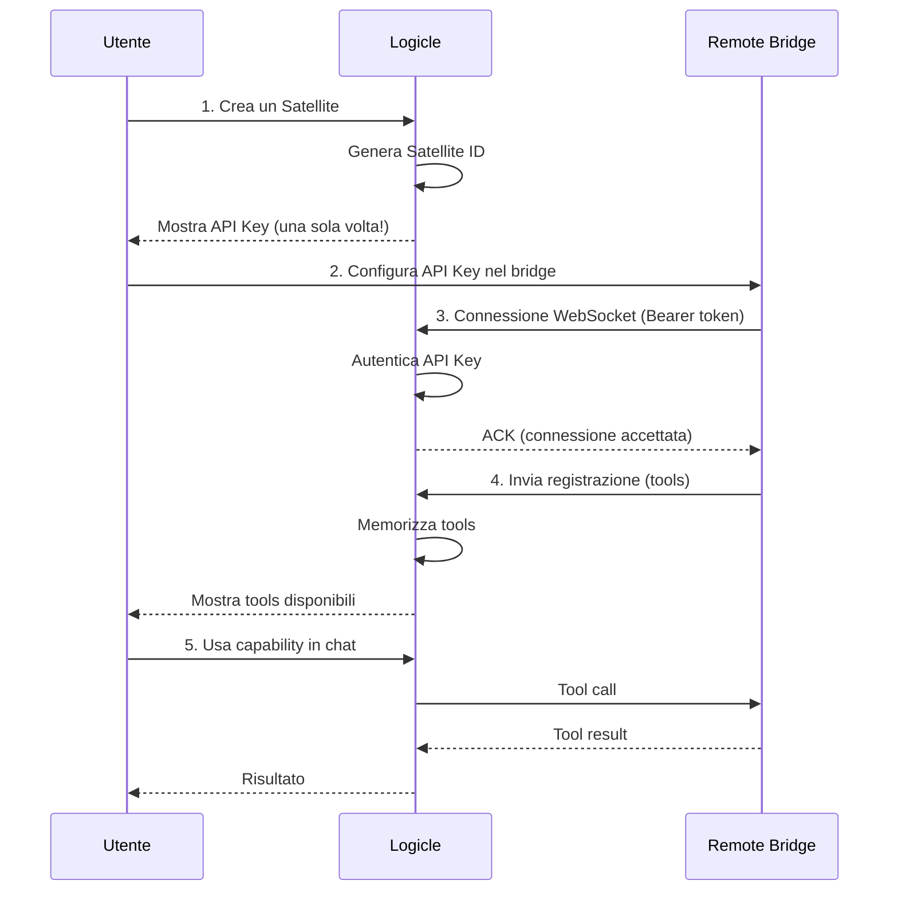
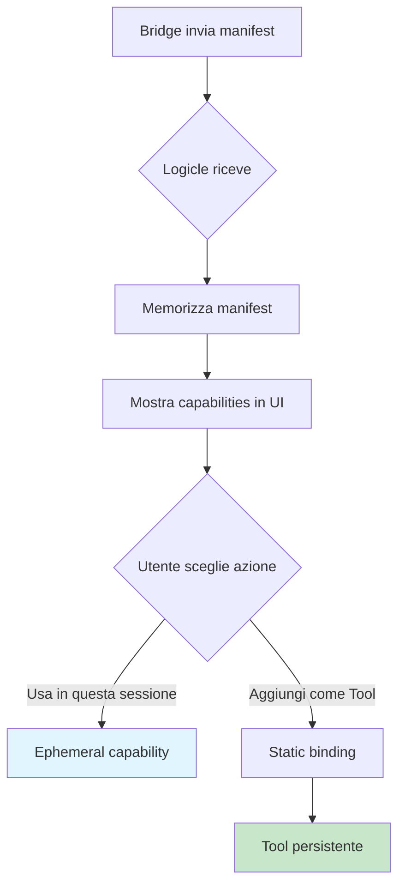
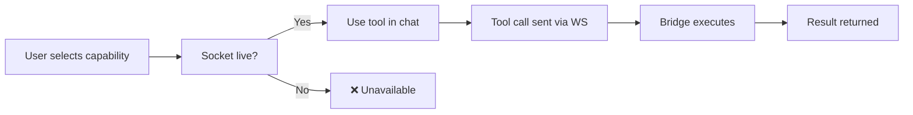
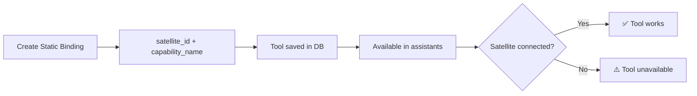
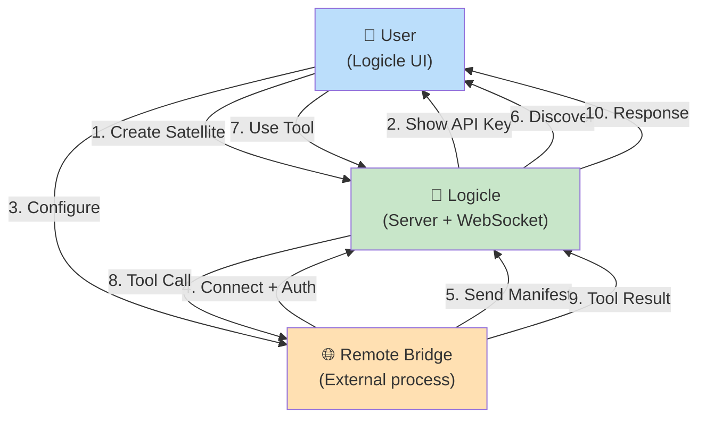

# Logicle Satellite Setup Guide

Questa guida spiega come connettere un satellite (bridge remoto) a Logicle e scoprire le sue capabilities.

## Overview

Un satellite è un processo remoto che si connette a Logicle via WebSocket e pubblica capabilities come MCP tools o modelli LLM remoti. Logicle autentica il satellite tramite API key e scopre dinamicamente le sue capacità.



## Step 1: Crea un Satellite in Logicle

### Dalla UI Admin
1. Vai a **Admin** → **Satellites**
2. Clicca **Create Satellite**
3. Inserisci un nome descrittivo (es. "Local Python Bridge", "Remote API Gateway")
4. Clicca **Create**

### Risultato
Logicle genera un ID univoco e ti mostra una **API Key** in formato:
```
<id>.<secret>
```

⚠️ **IMPORTANTE**: Salva questa key in un luogo sicuro (password manager, secret store, file `.env`). **Non potrai vederla di nuovo**.

## Step 2: Configura il Bridge Remoto

Configura il tuo bridge remoto per:
1. Connettersi a `ws://logicle-host/api/satellites/ws`
2. Passare l'API Key nell'header `Authorization`:
   ```
   Authorization: Bearer <api-key-from-step-1>
   ```

### Esempio (Node.js)
```javascript
const WebSocket = require('ws');

const apiKey = 'generated-api-key-from-logicle';
const ws = new WebSocket('ws://logicle-host/api/satellites/ws', {
  headers: {
    'Authorization': `Bearer ${apiKey}`
  }
});

ws.on('open', () => {
  console.log('Connected to Logicle');
  
  // Send registration with tools
  ws.send(JSON.stringify({
    type: 'register',
    name: 'My Python Bridge',  // optional; server assigns one if not provided
    tools: [
      {
        name: 'github',
        description: 'GitHub MCP tools',
        inputSchema: {
          type: 'object',
          properties: { /* ... */ }
        }
      },
      {
        name: 'local-qwen',
        description: 'Local Qwen model',
        inputSchema: {
          type: 'object',
          properties: { /* ... */ }
        }
      }
    ]
  }));
});

ws.on('message', (data) => {
  const msg = JSON.parse(data);
  
  if (msg.type === 'tool-call') {
    // Handle tool call
    const result = executeToolLocally(msg.method, msg.params);
    
    ws.send(JSON.stringify({
      type: 'tool-result',
      id: msg.id,
      content: [{ type: 'text', text: JSON.stringify(result) }]
    }));
  }
});
```

## Step 3: Scoperta di Capabilities

Dopo che il bridge è connesso e ha inviato il manifest:



### Nel tuo account Logicle:
1. Vai a **Admin** → **Satellites** → *[nome satellite]*
2. Vedi la sezione **Discovered Capabilities**
3. Per ogni capability, puoi:
   - **Use in this session** — Usa ephemeralmente senza salvarla
   - **Add as Logicle Tool** — Crea un binding permanente

## Step 4: Usa le Capabilities

### Ephemeral Usage (Sessione Temporanea)


- Funziona **solo** mentre il satellite è connesso
- Non crea un tool persistente
- Perfetto per test e utilizzo temporaneo

### Persistent Binding


- Crea un **tool permanente** in Logicle
- Disponibile in tutti gli assistenti
- Se il satellite si disconnette, il tool mostra uno stato "unavailable"
- Se il satellite si ricollega, il tool torna disponibile automaticamente

## Step 5: Rotazione della API Key

Se sospetti che l'API key sia stata compromessa:

1. Vai a **Admin** → **Satellites** → *[nome satellite]*
2. Sezione **API Keys**
3. Clicca il trash icon accanto alla vecchia key
4. Clicca **Create API Key** per generarne una nuova
5. Aggiorna il bridge con la nuova key

⚠️ I tool statici rimangono funzionanti perché sono legati a `satellite_id + capability_name`, non alla key raw.

## Ciclo di Vita di una Connessione

```mermaid
stateDiagram-v2
    [*] --> Connected: WS handshake OK
    Connected --> Manifest: Ricevi manifest
    Manifest --> Ready: Capabilities scoperte
    Ready --> ToolCall: Utente usa tool
    ToolCall --> Ready: Tool completo
    Ready --> Reconnecting: Bridge crash/network down
    Reconnecting --> Connected: Riconnessione
    Reconnecting --> Stale: Timeout
    Stale --> [*]
    
    Ready --> Disconnected: Explicit close
    Disconnected --> [*]
    
    note right of Connected
        API key validata
        User ID mappato
    end
    
    note right of Ready
        Capabilities visibili
        Static tools disponibili
    end
    
    note right of Stale
        Static tools unavailable
        Ephemeral tools offline
    end
```

## Architettura



## Troubleshooting

### Il bridge non si connette
- ✅ Verifica che l'API key sia corretta
- ✅ Controlla che l'header `Authorization` sia `Bearer <key>`
- ✅ Verifica il firewall / CORS se ws:// è bloccato
- ✅ Guarda i log di Logicle per errori di autenticazione

### Le capabilities non appaiono
- ✅ Verifica che il bridge abbia inviato il messaggio `manifest`
- ✅ Controlla che i nomi delle capability siano validi (ASCII slug)
- ✅ I nomi devono essere unici entro lo stesso satellite

### Il tool non funziona quando il satellite è offline
- ✅ Se è un **ephemeral tool**, è normale (richiede connessione live)
- ✅ Se è un **static binding**, il tool sarà segnato come unavailable
- ✅ Ricollega il satellite per ripristinare

### Come revochero una API key compromessa?
- ✅ Vai a **Admin** → **Satellites** → *[nome]* → **API Keys**
- ✅ Elimina la vecchia key
- ✅ Crea una nuova key
- ✅ I tool esistenti rimangono funzionanti (non dipendono dalla key raw)

## Best Practices

1. **Nomi descrittivi per i satellite**
   - ✅ "Python Data Science Bridge"
   - ❌ "Bridge 1", "Test"

2. **Labela le API keys**
   - ✅ "Production key", "Development key"
   - Aiuta a gestirle quando ne hai più di una

3. **Usa static bindings per tool permanenti**
   - Se un tool serve regolarmente, creane un binding permanente
   - Ephemeral è meglio per test/sperimentazione

4. **Rotazione periodica delle key**
   - Non è richiesto, ma è buona pratica di sicurezza
   - Logicle supporta multiple key per satellite

5. **Monitora la connessione**
   - Controlla lo stato del satellite in Admin
   - Configura alerting se il satellite si disconnette

## Formati di Capability

### MCP Tool
```json
{
  "type": "mcp_tool",
  "name": "github",
  "description": "GitHub MCP tools (search, create issues, etc)"
}
```

### LLM Model
```json
{
  "type": "llm_model",
  "name": "local-qwen-32b",
  "description": "Local Qwen model running on GPU"
}
```

### Validazione
- `name`: Required, ASCII slug (a-z, 0-9, -, _), max 50 chars
- `description`: Optional, max 200 chars
- Duplicati all'interno dello stesso manifest sono rejettati
- I nomi non sono globalmente unici (due satellite possono avere "github")

## Identificazione delle Capabilities

Logicle identifica univocamente una capability come:
```
<satellite_id> + <capability_name>
```

Questo significa:
- Ogni satellite può pubblicare il suo "github" indipendentemente
- Quando crei un static binding, è legato a questa coppia
- Se il satellite disconnette e ricollega con lo stesso nome, il binding funziona ancora
- Se cambi l'ID del satellite (rigeneralo), i vecchi binding non funzionano più

