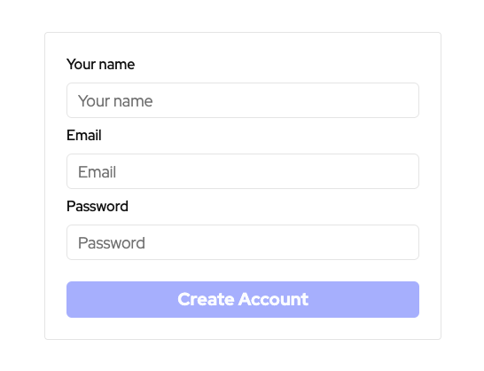

# Logicle Deployment Guide with Docker Compose

This document provides a comprehensive guide for deploying Logicle using Docker Compose.

This deployment method packages all necessary components, including the database and storage, required to operate a fully functional Logicle instance.

## Prerequisites

Before initiating the deployment process, ensure the following prerequisites are met:

- **Docker Knowledge:** Familiarity with basic Docker concepts.
- **Docker Installation:** Docker must be installed on your system. Refer to the [Docker Installation Guide](https://docs.docker.com/engine/install/) if needed.
- **Docker Compose:** Must be installed. See the [Docker Compose Installation Guide](https://docs.docker.com/compose/install/) for assistance.
- **RAM:** At least 500 MB of RAM should be available.
- **Storage:** A minimum of 300 MB of free disk space is required.
- **Port Availability:** 
  - **Port 80:** Always required for standard HTTP traffic.
  - **Port 443:** Necessary if deploying with HTTPS reverse proxy.

## Deployment Steps

Follow these five steps to deploy Logicle.

### Step 1: Create a Dedicated Directory

Create a directory specifically for Logicle deployment:

```bash
mkdir logicle/ && cd logicle/
```

### Step 2: Download the Docker Compose File

Choose the appropriate `docker-compose.yml` file based on your preference for exposing the service.

Options are available for setups with or without HTTPS reverse proxy and Let's Encrypt certificates.

| Configuration                     | Command                                                                                                                                                       |
|------------------------------|---------------------------------------------------------------------------------------------------------------------------------------------------------------|
| Standard (No HTTPS)                     | `curl -L https://raw.githubusercontent.com/logicleai/logicle/main/deploy/docker-compose/docker-compose-postgres.yml -o docker-compose.yml`           |
| Secure (With HTTPS reverse proxy)    | `curl -L https://raw.githubusercontent.com/logicleai/logicle/main/deploy/docker-compose/docker-compose-postgres-proxy.yml -o docker-compose.yml`     |

### Step 3: Download the Environment File

Download the `.env` file, which includes necessary configurations for Logicle:
```
curl -L https://raw.githubusercontent.com/logicleai/logicle/main/deploy/docker-compose/.env.postgres.example -o .env
```

### Step 4: Configure the .env File

Adjust the `.env` file with the following parameters:

- `APP_PUBLIC_FQDN`: Define the Fully Qualified Domain Name (FQDN) for external access, such as `logicle.yourdomain.com`, omitting the protocol (`http://` or `https://`). If not using a DNS record, provide the IP address instead.

- `NEXTAUTH_SECRET`: Create a secret key for JWT session encryption with this command:

  ```bash
  openssl rand -base64 32
  ```

### Step 5: Launch Logicle

Execute the following command to start Logicle:

```bash
docker compose up -d
```

You have now successfully deployed Logicle. Access the application via `http://<APP_PUBLIC_FQDN>/auth/join`, replacing `<APP_PUBLIC_FQDN>` with your configured IP or domain.

### Step 6: Creating the Initial Administrator User

Proceed to create the first user account in Logicle, who will serve as the inaugural administrator for the deployment.

Following the registration of this initial user, the option for autonomous sign-up will be automatically disabled.



## Environment Variables

The `.env` file, detailed in steps 3 and 4, is essential for setting environment variables during the Docker Compose deployment. It includes defaults that fit most use cases, but customization is available for specific requirements.

For an exhaustive list of application variables, consult the [Environment Variables Documentation](../environment-variables.md).