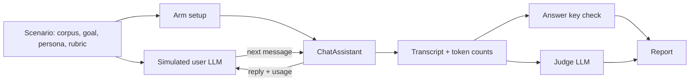

# Evaluation harness

## Goal

Measure whether one of Logicle's retrieval or context strategies is actually better than another,
and by how much, in the only two units that matter: did the user get what they came for, and what
did it cost.

Logicle is accumulating algorithms whose value is an empirical question — knowledge boxes, context
compression, sub-assistants, routing. Each one trades tokens for accuracy somewhere, and none of
them can be evaluated by reading the code. This harness exists so that "is the knowledge box worth
it" has an answer with a number attached.

## Model

An LLM impersonates a user pursuing a goal, and talks to a real Logicle assistant until it decides
the goal is met, gives up, or runs out of turns. The same scenario is replayed against several
**arms** — alternative assistant configurations — and the arms are compared.

For context-policy comparisons, a scenario can instead provide a saved **reference chat**. The
harness preloads that fixed history and sends one fixed final user message. Only the final exchange
is scored. This removes simulated-user trajectory variance and prevents facts already present in
the saved history from satisfying the answer-key gate.



The assistant under test is the real `ChatAssistant`, driven in-process against a throwaway SQLite
database with real files in storage. Ingestion, retrieval, preamble construction and token
accounting are the production code paths — the only substitutions are the human at one end and the
reviewer at the other.

## The wall between the user and the grader

The simulated user receives the goal and the persona. It never receives the rubric or the answer
key.

This is the single property the harness is built around. A simulated user that knows the answer
asks "so the penalty is 2.4%, right?", and from that moment every arm passes — including one that
retrieves nothing at all. The same applies to the exit condition: the simulated user decides only
whether it was _answered_, never whether the answer was _right_, because judging correctness would
require it to know the answer. `apps/backend/lib/eval/__tests__/simulatedUser.test.ts` asserts the
answer key never reaches its prompt.

Grading happens afterwards, in two passes:

- **The answer key** is a deterministic substring check over the assistant's own turns — what the
  user said is excluded, so a leaked answer cannot pass it. It is a hard gate: a run that never
  said the required fact scores zero, no matter how well it reads. `mustNotMention` catches the
  failure mode that matters most here, which is a confident answer taken from the wrong document.
- **The judge** is an LLM that grades how well the goal was served. It runs for every non-error
  transcript; the deterministic gate still controls the final score. The judge receives no arm
  metadata or tool-call/result parts.

The raw run artifact stores both verdicts; the markdown report shows their combined score. When
they disagree, the scenario is usually underspecified.

## Tool visibility

The assistant under test receives the real tool-call and tool-result parts in its next-turn
history, exactly as production does. The simulated user and judge receive a text-only transcript:
user messages and assistant text. Tool names are retained only as run metrics, not injected into
either LLM prompt. This keeps tool activity from revealing an arm directly to the judge.

## Arms

An arm is `setup(context) → { tools, knowledge, systemPromptSuffix?, setupCost? }`. Three ship
with the harness:

| arm                            | what it does                                                                                        |
| ------------------------------ | --------------------------------------------------------------------------------------------------- |
| `all-in-context`               | every document attached as assistant knowledge, sent in the preamble every turn — today's behaviour |
| `knowledge-box`                | documents reachable only through the `knowledge_box` tool, with ingestion questions                 |
| `knowledge-box-no-projections` | the same, with no ingestion questions — isolates chunk retrieval from projections                   |
| `compression-off`              | saved reference history is sent verbatim                                                            |
| `compression-keep-{0,1,2,4}`   | tool-driven retrieval with an explicit number of recent completed turns kept verbatim               |
| `compression-prefetch-keep-0`  | query-aware excerpts, with every eligible historical turn compressed                                |
| `compression-prefetch-keep-1`  | query-aware excerpts, retaining the immediately preceding completed turn verbatim                   |

Anything expressible as "same scenario, different assistant configuration" belongs here. An arm
can return `assistant.contextCompression` to compare compression on versus off; two chunk sizes
are two arms. Adding one does not touch the runner.

## Counting the cost of building an index

An arm that prepares something reports a `setupCost`, and the knowledge box arm reports the tokens
its ingestion questions actually consumed — which is why `computeProjections` returns usage.

Without this the comparison would be dishonest in the knowledge box's favour: it is cheap to query
precisely because it was expensive to build, and quoting only the per-conversation saving hides
the whole other side of the trade. The report therefore derives a **break-even point**: how many
conversations the index has to serve before it has paid for itself. A box that breaks even after
four conversations is obviously worth building; one that breaks even after eight hundred is not,
and the per-conversation figures look identical in both cases.

## Not lying about small samples

Repeated runs of the same scenario against the same arm vary a lot. Reporting one run per arm and
declaring a winner is the main way benchmarks like this mislead.

So `--repeat` defaults to 3, differences are reported as a percentile bootstrap interval on the
difference in means, and any difference whose interval contains zero is printed as _not separable
at this sample size_ rather than as a result. With fewer than two runs per arm the harness refuses
to claim separability at all and says so at the bottom of the report. The bootstrap RNG is seeded,
so re-rendering a report from stored runs gives the same intervals.

`--runs-out` writes a versioned artifact with the raw run records and run metadata (revision,
models, arms, scenarios and sweep configuration). Re-render it without an API key with
`--runs-in runs.json --out report.md`; this also accepts the legacy raw-run-array format.

## Running it

```bash
# Everything, three repetitions
OPENAI_API_KEY=... npx tsx apps/backend/scripts/eval.ts --repeat 3

# One scenario, two arms, watch the conversation happen
OPENAI_API_KEY=... npx tsx apps/backend/scripts/eval.ts \
  --scenario supplier-penalty --arms all-in-context,knowledge-box \
  --repeat 5 --verbose --out report.md --runs-out runs.json
```

The runner creates its own SQLite database and storage directory under the system temp dir and
removes them afterwards. It needs no server and touches no existing database.

Run the fixed-history, single-message context-compression suite with:

```bash
OPENAI_API_KEY=... npx tsx apps/backend/scripts/eval.ts \
  --suite context-compression --repeat 5 \
  --runs-out context-compression-runs.json --out context-compression-report.md
```

Its reference conversations live in
`apps/backend/lib/eval/scenarios/contextCompression.ts`. They retain no production content or
identifiers: only aggregate turn-count cohorts from expensive conversations informed their shape;
all prose, filenames, tool names and answer facts are synthetic.

The suite must include explicit boundary and **incompressible** fixtures, not only long histories:
short plain-text messages, short attachments, histories well below and above the resolved trigger,
and histories where the per-message or aggregate economic guard makes
compression a no-op. These fixtures establish that a small input is not made more expensive by
planning or by exposing a recovery tool. Expected results are deterministic: record the resolved
trigger, eligible messages, exact policies, estimated before/after tokens, whether the per-message
64-token and aggregate 384-token guards pass, and whether `context-retrieve` is visible. A no-plan
fixture must not be discarded because it produced no retrieval call.

The default comparison is `compression-off`, tool-only `compression-keep-0`, and query-aware
prefetch with windows 0 and 1. This isolates the two effects observed in the baseline run:
stochastic model tool use and the cost of retaining a recent turn. Wider
`compression-keep-{1,2,4}` arms remain selectable explicitly.

Compression has one intentional no-op guard: when the current user message is only a response
format/language/style preference or asks to reformat a previous response (for example, "solo
tabella differenze" or "non la vedo bene la tabella, la puoi rifare?"), the threshold may be
reached but historical compression and retrieval are skipped for that turn. Prefetching stale
material in response to a preference can make the assistant answer an earlier task instead of
acknowledging the new instruction; reformat requests also need the exact previous response intact.
The replay inspection reports this as
`compressionThresholdReached: true`, `triggered: false`, and
`compressionSkippedReason: "response-preference-turn"`.

Flags are documented in the header of `apps/backend/scripts/eval.ts`. The ones that matter:
`--repeat`, `--arms`, `--baseline`, `--model`, `--user-model`, `--judge-model`, `--no-judge`,
`--runs-out`, and `--runs-in`. Generated sweeps also accept `--seed`; use more than one seed before
generalising from a fixed corpus layout.

## Three-step production dataset workflow

The production dataset is private and incremental. It contains conversations and reviewed case
metadata, but no optimizer configuration. The coding agent owns semantic curation; the infra
commands only discover, transfer, and validate data.

Run the infrastructure commands from the `logicle-infra` checkout; run the replay harness from the
`logicle` checkout.

### 1. Create the empty dataset

```bash
./cli/eval_dataset create \
  --requirements examples/eval-dataset-requirements.json \
  --out /private/eval/context-kb-dataset
```

This creates `dataset.json`, `incoming/`, `cases/`, `reviews/`, `logs/`, and `rejected.jsonl` with
private permissions. It does not contact production and does not choose an optimizer target.

### 2. Let the coding agent find, inspect, and add cases

Discovery reads cheap metadata across all configured tenants and skips sources already accepted or
rejected in the dataset:

```bash
./cli/eval_dataset find \
  --dataset /private/eval/context-kb-dataset \
  --requirements examples/eval-dataset-requirements.json \
  --last 180d \
  --out /private/eval/context-kb-candidates.jsonl
```

The agent selects a candidate, downloads one complete bundle, reads it locally, and writes a small
review JSON. The transfer command never adds a case by itself:

```bash
./cli/eval_dataset download \
  --dataset /private/eval/context-kb-dataset \
  --tenant <tenant-host> --conversation <conversation-id>

./cli/eval_dataset add \
  --dataset /private/eval/context-kb-dataset \
  --bundle /private/eval/context-kb-dataset/incoming/candidate-<fingerprint>.sqlite \
  --review /private/eval/case-review.json --decision accept \
  --cohort knowledge-heavy --message <message-id>
```

For an unsuitable case, use the same `eval_dataset add` command with `--decision reject`; the private
`rejected.jsonl` ledger prevents it from being offered again. The review can contain the agent's
source-dependence decision, selected message, bounded source claim, replayability decision, and
reason. It is evidence for later checking, not an automatically trusted answer key.

Accepted cases have this shape:

```text
context-kb-dataset/
  dataset.json                 # membership, source metadata, structural requirements
  cases/case-001.sqlite        # complete private replay bundle
  reviews/case-001.json        # coding-agent review
  rejected.jsonl               # private rejected-candidate ledger
```

### 3. Run the optimizer

The optimizer reads the accepted bundles and chooses compression, retrieval, knowledge-box, model,
and objective parameters at run time. Those parameters stay outside `dataset.json`, so the same
dataset can be reused for different optimization experiments. For the current replay harness, a
single accepted case can be exercised with:

```bash
OPENAI_API_KEY=... npx tsx apps/backend/scripts/eval-replay-production-chats.ts \
  --bundle /private/eval/context-kb-dataset/cases/case-001.sqlite \
  --message <message-id> \
  --out /private/eval/case-results.json \
  --report /private/eval/case-report.md \
  --override '{"contextCompression":{"preset":"conservative"}}'
```

Keep bundles, reviews, raw responses, decrypted files, and identifiers outside the repository.
Publish only sanitized aggregates and reviewed failure labels.

## Cheap LLM probes

The repository also contains a small opt-in suite of source-grounded probes. These are not
production replays: they use sanitized fixtures and a mocked knowledge search result, so they are
cheap enough to run while changing prompts or retrieval behavior, and they never copy tenant data
into the repository.

```bash
# Static coverage ledger only; live probes remain skipped.
pnpm exec vitest run __tests__/llm-knowledge-probes.test.ts

# Live probes, using the cheap first backend by default.
pnpm run test:llm-probes

# Optional model override.
LLM_PROBE_MODEL=gpt-4.1-mini pnpm run test:llm-probes
```

The suite intentionally has two kinds of checks:

- **Forced retrieval** fixes the first function name so that the test isolates the hard part after
  retrieval: the model must use the returned evidence, preserve distinctions, abstain at a source
  boundary, and avoid mixing conflicting document versions. It does not measure whether the model
  decided to search.
- **Unforced retrieval** leaves tool selection on `auto`. A source-dependent question must cause a
  search, while a self-contained arithmetic question must not. These are the checks that expose a
  retrieval-strategy failure.

Each live probe checks the tool-call arguments as well as the answer. For example, the phone-book
fixture contains Luca's number and a neighbouring contact's different number; the user asks for
Luca, the search call must contain `Luca`, and the `answer-check.submit_answer` argument must
contain only Luca's number.
The search argument is the lookup key, not the phone number itself: the number must come from the
retrieved source passage. The suite also checks the actual mocked search invocation and source
evidence, so an answer that happens to guess correctly does not pass.

The compression benchmark uses the same downstream-action oracle. Its recovery function is
controlled only to isolate compression's source-to-answer path; the final `answer-check` argument
must still be correct, and the recovery call must carry the exact compressed message or file id.
The unforced probes are the place to measure whether a model independently decides to retrieve.

These probes complement, rather than replace, production replay. Replay remains the authority for
real retrieval-call rate, BM25/ingestion quality, compression savings, and tenant-specific
failures. In particular, a no-call result on an eligible source-dependent production turn remains
a failure; it must not be hidden by forcing a tool call in the probe suite.

## The flip test — measuring what an arm does when the answer is not there

A success rate on answerable questions cannot tell a system that _covered_ the corpus from one that
guessed and happened to be right: both produce a transcript with the right number in it. The only
way to separate them is to ask the same question of a corpus that does not contain the answer.

`--flip` generates each sweep size twice. The two corpora are produced from the same seed and are
byte-identical except that the negative one has had the answer removed — by default the needle
document stays and loses only its payment clause, which is the harder case because the document a
retriever would surface is still there and still looks relevant. `--flip-withhold document` removes
the document instead, which asks the different question of whether the counterparty is under
contract at all. Both halves get the same goal, persona and turn budget, so the simulated user
cannot tell which corpus it is on. The goal is symmetric: either return the sourced rate or
establish that the relevant contract does not state one. Generated headings are unnumbered, so
removing the clause does not leave a numbering gap or placeholder that reveals the intervention.

```bash
OPENAI_API_KEY=... npx tsx apps/backend/scripts/eval.ts \
  --sweep 20,60 --flip --repeat 5 \
  --arms all-in-context,knowledge-box \
  --runs-out flip-runs.json --out flip-report.md
```

Each run gets a conservative lexical classification — only the needle percentage, another or
unexpected percentage, no percentage, or no clean conclusion before the user gives up or the turn
budget expires — and the halves are paired per arm and repetition. `coverage` is the only passing
combination:

| positive corpus   | negative corpus   | verdict                       |
| ----------------- | ----------------- | ----------------------------- |
| answers correctly | declines          | `coverage`                    |
| answers correctly | answers anyway    | `hallucination-under-absence` |
| answers correctly | runs out of turns | `over-searching`              |
| declines          | declines          | `over-closure`                |

Three things to know before reading a flip report:

- **Check the `pos. failure` column first.** Those pairs never established the answer on the
  positive corpus, so whatever they did under absence says nothing about abstention. A column that
  is not near zero means the question was too hard for the arm, and the coverage rate below it is
  measuring the wrong thing.
- **The paired verdict is a lexical proxy, not a semantic assertion classifier.** Any percentage
  in the negative answer counts as a value under absence, including an unexpected value and a
  value quoted only to deny it. Conversely, `abstained` means the simulated user accepted a
  conversation containing no percentage; it does not prove the assistant explicitly said the
  answer was absent. Read the judge verdict for that qualitative distinction.
- **Giving up is not abstention.** A `gave-up` or `max-turns` negative run is `over-searching`, not
  coverage. The positive half must reach the goal and pass its full deterministic answer key;
  otherwise the pair is a `pos. failure` even if the needle happened to appear in the transcript.
- **Pairing by repetition index is arbitrary.** Each run has its own stochastic trajectory, so a
  single pair is not a result; the rate over repetitions is. Use `--repeat 5` or more.

## Layout

| path                        | what it is                                  |
| --------------------------- | ------------------------------------------- |
| `lib/eval/types.ts`         | scenario, arm, run result                   |
| `lib/eval/harness.ts`       | drives one (scenario, arm) run              |
| `lib/eval/referenceChat.ts` | saved chat → production message DTOs        |
| `lib/eval/simulatedUser.ts` | the LLM playing the user                    |
| `lib/eval/judge.ts`         | the LLM grading transcripts                 |
| `lib/eval/metrics.ts`       | answer key, totals, scoring — pure          |
| `lib/eval/abstention.ts`    | flip-test classification and pairing — pure |
| `lib/eval/stats.ts`         | seeded RNG, bootstrap intervals — pure      |
| `lib/eval/cost.ts`          | model pricing — pure                        |
| `lib/eval/report.ts`        | aggregation, break-even, markdown — pure    |
| `lib/eval/arms.ts`          | the shipped arms                            |
| `lib/eval/scenarios/`       | scenario definitions                        |

Everything marked pure is unit-tested and needs no API key.

## Open

- **The knowledge corpus is synthetic.** `supplierContracts.ts` is built to have the right shape — one needle,
  four near-identical distractors, realistic boilerplate — but it is not a real corpus. Mining real
  scenarios is the intended next step, and the answer keys they produce need a human pass.
- **One provider at a time.** The assistant, the simulated user and the judge all run on the same
  provider. Using a different model family for the judge would reduce the risk of a model
  preferring its own phrasing.
- **Setup cost is paid per repetition.** Ingestion runs once per run rather than once per arm, so
  wall-clock time scales with `--repeat` more than it needs to. It does not distort the reported
  numbers, since setup cost is reported per-arm rather than summed.
- **Context-compression references are anonymized shape fixtures.** They reproduce aggregate
  message-count cohorts and failure modes, not any real conversation's wording. Add reviewed,
  tenant-approved fixtures separately if production semantics need to be represented.

## Replaying expensive production turns

The synthetic context-compression suite proves the policy against known fixtures. To see how a
change behaves on _real_ expensive traffic — a compression preset, a different model, a new build —
use the two-stage replay workflow: **build a bundle**, then **replay it** through the code you want
to test. The stages are fully separated. The bundle is a self-contained SQLite file; once it
exists, replay never touches the source deployment, S3, or any network beyond the LLM provider.

Knowledge arms can be compared directly in one replay. For other changes, the "before" number is
production's own `MessageAudit` input-token count, which travels in the bundle. Replay cost is
primarily cache-aware: use provider-reported input, cached-read, cached-write, and output usage
when available. If cache telemetry is missing, price the affected input at the full input rate.
The report also shows an undiscounted/full-price counterfactual, but it does not replace the
primary cache-aware total.

### Stage 1 — build the bundle

`eval-build-replay-bundle.ts` takes exactly one positional conversation id. It does not choose a
message, calculate a parent lineage, mine traffic, rank turns, or apply cohort filters. Choosing an
interesting conversation (for example from audited token trends) belongs to the infra discovery
tools. The builder copies into the bundle the complete conversation: every `Message` and
`MessageAudit`, the published assistant configuration (`Assistant` / `AssistantVersion` /
`Backend`), every conversation attachment, and every knowledge file attached to the published
assistant version. `File` / `FileBlob` rows are rewritten as `production-replay-user`-owned with
encryption cleared, and the bytes themselves are **decrypted** into a
`ReplayFileBlob(path, size, bytes)` table. No provider credentials, no storage credentials, no
other tenant data. If the published assistant has configured tools, the bundle records their
presence in `ReplayMetadata`; tool exposure remains an optimizer/replay decision.

The bundle is still production data: it contains verbatim conversation content and decrypted file
bytes. Store, transfer, and delete it under the tenant's data-handling rules.

Keep bundles and raw replay outputs in the ignored `/tmp/production-chat-replays/` directory (or
another approved location outside the repository). Do not commit real chat bundles, raw responses,
or unreviewed reports; publish only sanitized aggregate findings later, together with any
knowledge-box tuning they motivate.

```bash
mkdir -p /tmp/production-chat-replays
```

The builder is infra-agnostic: it reads the source database from `--source-db` (or `$DATABASE_URL`)
and file bytes through the normal storage stack (`FILE_STORAGE_LOCATION` plus the
`FILE_STORAGE_ENCRYPTION_*` vars, needed when the conversation or assistant has files).

**Lowest friction — run it on a running instance.** Exec into a Logicle container: `DATABASE_URL`
and `FILE_STORAGE_LOCATION` are already set to that instance's database and object store, so no
flags and no proxy are needed. Copy the bundle back out afterwards (`kubectl cp` / `docker cp`).

```bash
# inside the container (its own env already points at the right DB + storage)
npx tsx apps/backend/scripts/eval-build-replay-bundle.ts \
  --out /tmp/production-chat-replays/conversation.sqlite <conversation-id>
```

**From a workstation** — point `--source-db` and `FILE_STORAGE_LOCATION` at the tenant through
whatever proxy / SSH tunnel your ops tooling provides (that wrapper, not this script, owns the
tenant plumbing):

```bash
FILE_STORAGE_LOCATION=s3://logicle-tenant-42-files \
FILE_STORAGE_ENCRYPTION_ENABLE=1 FILE_STORAGE_ENCRYPTION_KEY=... \
npx tsx apps/backend/scripts/eval-build-replay-bundle.ts \
  --source-db postgres://readonly@127.0.0.1:5432/logicle \
  --out /tmp/production-chat-replays/conversation.sqlite <conversation-id>
```

The builder rejects conversation-level fidelity failures it cannot represent offline:

- **assistant available** — the assistant and its published version must still exist.
- **no sub-assistants** — those still cannot be reproduced offline without a capability-specific
  fixture. Assistant knowledge is supported and copied into the bundle.

If a conversation attachment or assistant-knowledge file cannot be resolved, the builder writes
the exact reason to `<out>.skipped.json` and exits unsuccessfully. It never silently omits a file.
Configured assistant tools are not automatically exposed by the replay. If the optimizer wants to
run without them, pass `--disable-configured-tools`. The runner checks the selected production turn
and rejects this mode when that turn contains a tool call or tool-auth event. Tool calls in earlier
history remain saved in the lineage, but this result must be labelled as a stripped-tool replay
rather than production-faithful.

### Stage 2 — replay the bundle

```bash
# Default: replay the latest audited user message with a saved assistant response.
OPENAI_API_KEY=... npx tsx apps/backend/scripts/eval-replay-production-chats.ts \
  --bundle /tmp/production-chat-replays/conversation.sqlite \
  --out /tmp/production-chat-replays/replay-results.json \
  --report /tmp/production-chat-replays/replay-report.md

# Optimizer variant: disable configured assistant tools for a target turn that did not use them.
OPENAI_API_KEY=... npx tsx apps/backend/scripts/eval-replay-production-chats.ts \
  --bundle /tmp/production-chat-replays/conversation.sqlite \
  --disable-configured-tools \
  --out /tmp/production-chat-replays/replay-no-tools-results.json \
  --report /tmp/production-chat-replays/replay-no-tools-report.md

# Compare the exact real turn across knowledge strategies. The knowledge-box index is built once
# per arm and reused by all repetitions.
OPENAI_API_KEY=... npx tsx apps/backend/scripts/eval-replay-production-chats.ts \
  --bundle /tmp/production-chat-replays/conversation.sqlite --knowledge-arms \
  assistant-knowledge,knowledge-box,knowledge-box-no-projections \
  --repeat 3 --judge \
  --out /tmp/production-chat-replays/knowledge-results.json \
  --report /tmp/production-chat-replays/knowledge-report.md

# Or select one exact message from the bundled conversation.
OPENAI_API_KEY=... npx tsx apps/backend/scripts/eval-replay-production-chats.ts \
  --bundle /tmp/production-chat-replays/conversation.sqlite --message <message-id> \
  --out /tmp/production-chat-replays/on.json --report /tmp/production-chat-replays/on.md --judge \
  --override '{"contextCompression":{"preset":"conservative","retrievalMode":"prefetch"}}'

# Free inspection: select the message, reconstruct its parent lineage, and calculate the exact
# compression decisions plus tokenizer-based before/after history estimates without an LLM call.
npx tsx apps/backend/scripts/eval-replay-production-chats.ts \
  --bundle /tmp/production-chat-replays/conversation.sqlite --message <message-id> --inspect-only \
  --out /tmp/production-chat-replays/inspection.json \
  --report /tmp/production-chat-replays/inspection.md \
  --override '{"contextCompression":{"preset":"conservative","retrievalMode":"prefetch"}}'

# The same selector and parent-lineage code can read the configured live DB/storage instead.
DATABASE_URL=... FILE_STORAGE_LOCATION=... OPENAI_API_KEY=... \
npx tsx apps/backend/scripts/eval-replay-production-chats.ts \
  --conversation <conversation-id> --message <message-id> \
  --out /tmp/production-chat-replays/live.json --report /tmp/production-chat-replays/live.md

# Mode B — gpt-5.6-luna, off then on, measured by the same ruler:
OPENAI_API_KEY=... npx tsx apps/backend/scripts/eval-replay-production-chats.ts \
  --bundle /tmp/production-chat-replays/conversation.sqlite \
  --out /tmp/production-chat-replays/b-off.json --report /tmp/production-chat-replays/b-off.md \
  --model gpt-5.6-luna --override '{"contextCompression":null}'
OPENAI_API_KEY=... npx tsx apps/backend/scripts/eval-replay-production-chats.ts \
  --bundle /tmp/production-chat-replays/conversation.sqlite \
  --out /tmp/production-chat-replays/b-on.json --report /tmp/production-chat-replays/b-on.md --judge \
  --model gpt-5.6-luna \
  --override '{"contextCompression":{"preset":"conservative","retrievalMode":"prefetch"}}'
```

The runner accepts either `--bundle <sqlite>` or `--conversation <id>` for direct live access.
It selects `--message <id>`, or defaults to the latest audited user message with a saved assistant
response, and reconstructs that message's parent lineage. Bundle mode points the app at a scratch
copy and at `FILE_STORAGE_LOCATION=replaydb:`; live mode uses the already configured DB and storage.
The `ChatAssistant` receives no persistence callbacks, so live mode does not write messages.
It can still populate the normal `CompressedMessage` and `FileAnalysis` caches. Use a bundle when
the source DB must not be mutated; a database read-only role can cause a live compression replay to
fail on a cold cache rather than silently making it read-only.
The runner rebuilds the saved assistant with `--override` merged over its configuration, runs the
turn for every selected arm and repetition, and records the response, provider token usage, and
priced cost. `--override` is a JSON object merged over `model` / `systemPrompt` /
`temperature` / `tokenLimit` / `reasoning_effort` / `contextCompression` (use
`{"contextCompression":null}` to turn it off); its shape follows whatever the running code's schema
accepts, so newer options work without changing this script.

By default, replay preserves the published assistant's knowledge files. `--knowledge-arms` turns
the same fixed production turn into a paired knowledge evaluation. `assistant-knowledge` embeds the
files exactly as production does; `knowledge-box` indexes the same files with generic summary and
key-fact projections; `knowledge-box-no-projections` isolates chunk retrieval. Knowledge-box arms
require bundle mode because indexing writes evaluation rows. `--repeat` reruns each arm while
reusing its index, and the report shows mean run cost, one-time setup cost, and break-even
conversations against the assistant-knowledge baseline. The generic projection questions are a
baseline, not a substitute for corpus-specific administrator questions.

Each runner invocation selects one message and runs one assistant turn per selected arm and
repetition. A turn can make multiple provider calls when the assistant loops through
context-retrieval tools; token usage is summed over all of them and the JSON/report records both the
provider-call count and tool-call names. `--judge` adds another provider request per run. Before
making the call, the runner rejects a production error, a missing response or parent, model drift,
an unsupported lineage containing tool/auth/error activity, and assistant capabilities for which
no fixture exists. `--inspect-only` stops after selection, lineage reconstruction, compression
planning, application, and token estimation: it requires no provider key and makes no LLM call.

### Decide which experiment you are running

Knowledge retrieval, history compression, and their combination are three different experiments.
Name the experiment before selecting a conversation or interpreting a result. An assistant having
knowledge files configured does not prove that a tested turn used knowledge, just as enabling
compression does not prove that compression triggered.

| experiment          | hold constant                      | candidate requirement                                                              | required run evidence                                                                                                   |
| ------------------- | ---------------------------------- | ---------------------------------------------------------------------------------- | ----------------------------------------------------------------------------------------------------------------------- |
| knowledge box       | message, model, compression config | the answer depends on assistant knowledge and is not already in the preceding chat | compare `assistant-knowledge` with `knowledge-box`; record retrieval-call rate and source-grounded quality              |
| context compression | message, model, knowledge arm      | enough eligible history for compression to trigger                                 | compare compression off vs on; `inspection.triggered` is true and estimated history decreases                           |
| combined            | message and model                  | a long history plus a new question whose answer still requires assistant knowledge | run the 2×2 matrix below; compression triggers, and retrieval-call rate plus source-grounded quality are reported for D |

`context-retrieve__*` and `knowledge_box__*` are different evidence. The former means the assistant
looked back into compressed conversation history; it does not mean assistant knowledge was
retrieved. Conversely, a `knowledge_box__*` call on a turn where compression did not trigger is a
knowledge-box test, not a combined test. Compression can be valid without a `context-retrieve__*`
call because the changed history sent to the model is itself the treatment.

Knowledge-box search has a hard per-turn budget of four calls. This is only a cost and runaway-search
guardrail: the model still chooses whether to list documents, which languages or terms to query, and
which passages to read. After the budget is exhausted, the model must answer from retrieved evidence
or state the source boundary.

#### Knowledge-box-only comparison

Choose a message with a source-grounded question and no answer-bearing prior chat. Keep compression
identical across arms; normally disable it to isolate knowledge retrieval.

```bash
npx tsx apps/backend/scripts/eval-replay-production-chats.ts \
  --bundle /tmp/production-chat-replays/conversation.sqlite --message <message-id> \
  --knowledge-arms assistant-knowledge,knowledge-box,knowledge-box-no-projections \
  --override '{"contextCompression":null}' --repeat 3 --judge \
  --out /tmp/production-chat-replays/knowledge.json \
  --report /tmp/production-chat-replays/knowledge.md
```

Establish source dependence before looking at model behavior. If an eligible box run makes no
`knowledge_box__*` call, keep it and classify it as a retrieval-strategy failure; never search for
a replacement candidate after seeing the outcome. A no-call run whose answer was already available
in history is instead a candidate-selection error: it may measure the smaller box preamble, but it
does not test knowledge retrieval.

The current offline replay has no fixture for production tool execution. A selected production
turn that actually contains a tool call is therefore rejected during inspection; do not strip that
call and relabel the resulting conversation as faithful replay. Historical tool activity in the
lineage is likewise an eligibility failure until a matching fixture exists.

#### Context-compression-only comparison

Use the same message, model, and one fixed knowledge arm for an off/on pair. Run `--inspect-only`
first; reject the candidate if compression does not trigger or does not reduce history.

```bash
# Off
npx tsx apps/backend/scripts/eval-replay-production-chats.ts \
  --bundle /tmp/production-chat-replays/conversation.sqlite --message <message-id> \
  --knowledge-arms assistant-knowledge \
  --override '{"contextCompression":null}' --repeat 3 --judge \
  --out /tmp/production-chat-replays/compression-off.json \
  --report /tmp/production-chat-replays/compression-off.md

# On
npx tsx apps/backend/scripts/eval-replay-production-chats.ts \
  --bundle /tmp/production-chat-replays/conversation.sqlite --message <message-id> \
  --knowledge-arms assistant-knowledge \
  --override '{"contextCompression":{"preset":"conservative","retrievalMode":"prefetch"}}' \
  --repeat 3 --judge --out /tmp/production-chat-replays/compression-on.json \
  --report /tmp/production-chat-replays/compression-on.md
```

If the selected assistant has knowledge, this remains a compression-only experiment when the
knowledge strategy is fixed. Describe it as "compression on a knowledge-enabled assistant," not as
"knowledge box + compression."

#### Combined knowledge-box and compression comparison

The combined experiment is factorial. Run four cells for the exact same message and model:

| cell | knowledge strategy  | compression |
| ---- | ------------------- | ----------- |
| A    | assistant knowledge | off         |
| B    | assistant knowledge | on          |
| C    | knowledge box       | off         |
| D    | knowledge box       | on          |

The runner can produce A/C and B/D in two invocations:

```bash
# A/C: knowledge strategies with compression off
npx tsx apps/backend/scripts/eval-replay-production-chats.ts \
  --bundle /tmp/production-chat-replays/conversation.sqlite --message <message-id> \
  --knowledge-arms assistant-knowledge,knowledge-box \
  --override '{"contextCompression":null}' --repeat 3 --judge \
  --out /tmp/production-chat-replays/combined-off.json \
  --report /tmp/production-chat-replays/combined-off.md

# B/D: the same knowledge strategies with compression on
npx tsx apps/backend/scripts/eval-replay-production-chats.ts \
  --bundle /tmp/production-chat-replays/conversation.sqlite --message <message-id> \
  --knowledge-arms assistant-knowledge,knowledge-box \
  --override '{"contextCompression":{"preset":"conservative","retrievalMode":"prefetch"}}' \
  --repeat 3 --judge --out /tmp/production-chat-replays/combined-on.json \
  --report /tmp/production-chat-replays/combined-on.md
```

Before accepting the candidate, verify all of the following:

- Cell D has `inspection.triggered: true`, reduces estimated history, and summarizes at least one
  message.
- Record whether cell D emits `knowledge_box__*` calls in every repetition. Report the retrieval-call
  rate as an outcome; zero calls on a source-dependent candidate is a combined-strategy failure,
  not grounds to exclude the candidate or rerun until a call appears.
- The required source facts are absent from the answer-bearing portion of prior chat. A late topic
  shift to a new document-grounded question is usually a better real-chat candidate than a long
  conversation that keeps refining the same answer.
- For a production replay, keep the stored message unchanged. If you rewrite the question or splice
  it onto different history, label the case derived or synthetic rather than real-chat replay.
- A, B, C, and D use the same selected message and model. In Mode B, all four cells use the same
  cheap model rather than comparing any of them with production `MessageAudit` tokens.
- Quality is checked against reviewed source facts. The saved production response and `--judge`
  verdict are useful references, but neither establishes factual correctness.
- Compression does not change knowledge ingestion, so count the knowledge-box setup cost once—not
  once per off/on invocation—when calculating operational break-even for the shared corpus.

Report the main effects separately: knowledge-box effect without compression (C − A), compression
effect with assistant knowledge (B − A), and compression effect with knowledge box (D − C). The
interaction is `(D − C) − (B − A)`. Do not claim a combined win from D alone.

For every production replay, inspect `results[].toolCalls`, `results[].error`, provider-call counts,
and token usage in the JSON artifact. Planning estimates and successful process exit are not enough:
a provider failure can yield no useful response, and a tool-enabled configuration can answer
without invoking its tool. Until tool-result logging is redacted, do not stream replay stdout or
stderr into shared terminals or transcripts; redirect it to an approved production-data location
or `/dev/null`, and delete it with the bundle and raw artifacts after extracting sanitized
aggregates.

### Real-chat failure investigation protocol

For the normal optimization loop, use the three phases below. The coding agent can repeat discovery
and curation until the dataset covers the required traffic shapes; no large speculative download is
needed.

1. **Create and curate.** Initialize the empty dataset, discover metadata across all tenants,
   download one complete bundle at a time, inspect it locally, and accept or reject it with the
   mechanical infra command.
2. **Optimize.** Run the smallest useful comparison on accepted bundles: knowledge off/on for
   knowledge cases, compression off/on for compression cases, and 2×2 only for genuinely combined
   cases. Keep optimizer parameters outside the dataset.
3. **Confirm and publish.** Repeat only material differences or failures with the exact same bundle
   and message, verify source facts, retain failures in the denominator, and publish sanitized
   aggregates.

Use these labels in the private case reviews. The three `ineligible-*` labels are mutually exclusive;
for an eligible case, record every applicable failure label (for example, a wrong D response can
also have made no box call). `combined-preserved` applies only when no failure label applies.

| label                         | meaning                                                                                                | count as a combined quality/cost result?                   |
| ----------------------------- | ------------------------------------------------------------------------------------------------------ | ---------------------------------------------------------- |
| `ineligible-history-answer`   | The answer was already available in history.                                                           | No — candidate-selection error.                            |
| `ineligible-no-source`        | No reviewed source fact can establish correctness.                                                     | No — cannot make a factual claim.                          |
| `ineligible-no-compression`   | Compression did not trigger or did not reduce history.                                                 | No — not a compression treatment.                          |
| `combined-no-net-gain`        | D triggered, but total replay input/cost was no lower than C after all provider calls.                 | Yes — the strategy gave no operational gain.               |
| `combined-quality-regression` | D is wrong or materially less complete against reviewed facts while C is correct.                      | Yes — investigate history loss, retrieval, or interaction. |
| `knowledge-retrieval-failure` | A source-dependent D repetition made no `knowledge_box__*` call.                                       | Yes — strategy failure, even if it guessed correctly.      |
| `compression-insufficient`    | D triggered but could not fit or errored at the selected preset.                                       | Yes — preset boundary.                                     |
| `combined-preserved`          | D triggered, retrieved when required, was source-correct, and improved the chosen operational measure. | Yes — a passing case, not a general claim.                 |

For each eligible case, retain this **sanitized** row in the investigation summary; it is the minimum
evidence needed for another agent to audit the conclusion without seeing private content:

| case      | cohort                               | reviewed source claim | history reduction | D box-call rate | A/B/C/D correctness | D vs C input/cost | outcome                                           | suspected mechanism |
| --------- | ------------------------------------ | --------------------- | ----------------: | --------------: | ------------------- | ----------------- | ------------------------------------------------- | ------------------- |
| opaque id | attachment / topic shift / text-only | yes                   |                 % | calls / repeats | reviewed            | labels above      | source miss, lost history, tool-result loss, etc. |

Do not create a numerical “material saving” threshold after looking at results. State it before a
batch (or use the strict `no lower than C` rule for `combined-no-net-gain`) and keep it fixed across
the cohort. A batch whose interesting cases are all ineligible is itself a finding about traffic
composition; it is not permission to relabel them as successes.

### First real-chat investigation: bounded execution plan

This is the default first batch. Execute it in order; do not tune the knowledge box, compression
preset, prompts, or candidate-selection rules during the batch. The objective is to map failure
regions, not to produce a headline win.

| phase       | action                                                                                           | exit criterion                                     | deliverable                          |
| ----------- | ------------------------------------------------------------------------------------------------ | -------------------------------------------------- | ------------------------------------ |
| 1. Curate   | Discover, download, inspect, and add/reject cases iteratively across tenants and traffic shapes. | Dataset contains accepted cases and rejection log. | `dataset.json`, bundles, reviews     |
| 2. Optimize | Run the minimum off/on matrix with optimizer parameters supplied at invocation time.             | Every accepted case has comparable metrics.        | Raw runs and token/tool evidence     |
| 3. Confirm  | Repeat only material differences, verify source facts, and publish sanitized aggregates.         | Finding is repeated or marked undetermined.        | Sanitized ledger and next experiment |

The batch is complete when phase 3 is complete, even if it finds no failure. Do **not** keep sampling
until a preferred result appears. If too few candidates survive eligibility, improve discovery or
expand the traffic shapes rather than forcing unsuitable cases into the dataset. A code change
belongs on a new branch only after this baseline batch is closed; rerun the same saved bundles after
the change, with the source claims and private case reviews frozen.

### Operating modes — cost/quality testing without a big bill

A replay calls a real provider with a real (often six-figure-token) prompt. Keep it cheap:

- **Build the bundle once, replay many times.** Dataset curation is the only phase that touches
  production and it costs nothing. Iterate on the private local dataset afterwards.
- **One bundle, one complete conversation; one selected message per run.** Select conversations with
  the read-only infra discovery tools before downloading them.
- **`--judge` roughly doubles the cost** (a second model call over the same prompt). Get the token
  numbers for all your turns first; judge only the ones whose numbers look worth a closer look.

For source-dependent production replays, an optional source-grounded judge can be run with a
private JSON file containing reviewed evidence. The file must have this shape:

```json
{
  "claim": "The reviewed sources establish ...",
  "evidence": ["Bounded source excerpt or reviewed fact ...", "Another source-grounded fact ..."]
}
```

Pass it as `--judge-source /private/path/source-evidence.json`. The source-grounded verdict is
reported separately from the production-response comparison; it does not enter the assistant or
simulated-user prompt and remains only a second opinion. Manual source review is still required,
and the evidence file must not be published with raw production bundles or responses.

**Two ways to get a saving number**, depending on how much you trust the persisted counts:

- **Mode A — same model, trust `MessageAudit`.** Replay on the assistant's real model with only
  `--override '{"contextCompression":{…}}'` changed. The "before" is production's own
  `MessageAudit` input tokens (in the bundle, shown in the report) — no off run needed. This is
  the cheapest honest measurement: one call per turn. Its limit is that `MessageAudit.tokens` was
  counted by the code as it was then, so treat single-digit-percent deltas as noise.
- **Mode B — `gpt-5.6-luna`, run both sides.** When you want an off/on pair measured by the same
  ruler and the real model is expensive, replay twice — `'{"contextCompression":null}'` and
  `'{"contextCompression":{…}}'` — on `gpt-5.6-luna` via `--model`. This is the intended cheap
  OpenAI replay/eval model for this mode. The authoritative measurements are provider-reported
  token/usage counts and their off/on delta; USD is a derived estimate, not the ruler. For Luna,
  use `$0.20/M` input, `$0.02/M` cached input, `$0.25/M` cached write, and `$1.20/M` output;
  for requests above 272k tokens use `$0.40/M` input, `$0.04/M` cached input, `$0.50/M` cached
  write, and `$1.80/M` output. If cache telemetry is absent, use the corresponding full input
  rate. Keep the model/provider fixed across the pair. The override model must be registered for
  the selected replay provider.

Never change the model **and** compare against saved production cost or token counts: a different
tokenizer and context window make that delta meaningless. If the replay model differs from
production, compare Luna off/on only. Mode A keeps the model; Mode B keeps the ruler.

**Reading the result:**

- **Saving** — replay input tokens vs the baseline (production for Mode A, the off run for Mode B),
  as a percentage. The actual order is compression first, then `truncateChat`. If an uncompressed
  chat was already at `tokenLimit`, shrinking its messages can simply let truncation retain more
  old messages, leaving provider input near the same limit. That cohort does not isolate the value
  of compression; prefer audited conversations whose input-token series is monotonic and remains
  below the assistant's limit.
- **Quality** — `--judge` classifies the response against the saved production reply (a
  **reference, not an answer key** — review every non-equivalent verdict yourself). The failure
  mode to look for: a summary/excerpt that dropped an exact figure the user asked about.
- **Doesn't fit** — `conservative` often can't pull a 700k-token turn under a 400k window; it
  errors rather than truncate silently. Try `aggressive`, or record the turn as "compression
  insufficient at this preset".

`replay-report.md` shows, per turn, production's audited input tokens next to the replay's input
tokens, output tokens, priced cost, and the input-token delta. With `--judge`, each response is
also classified against the saved production reply — a **reference for the judge, not a factual
answer key**, so review every non-equivalent case.

To test a **new build**, check it out (or deploy it) and run the runner from there — it passes the
config through and calls whatever `ChatAssistant` is in the tree. Build and replay from the same
checkout so the bundle schema matches.

### Deploy-then-evaluate

Low-risk rollout for a change like a compression policy: deploy the new build to one tenant with
the policy **off**, let real traffic accumulate `MessageAudit` rows, build a bundle from that
instance, then replay it twice — once as-is, once with `--override` enabling the policy — and
compare cost and judged quality before turning it on for real.

### Agent delegation

The coding agent can run the complete loop:

1. Create the empty dataset, discover candidates across tenants, download bundles on demand, inspect
   them locally, and accept or reject them with the infra commands.
2. Run the replay matrix with optimizer parameters supplied separately from the dataset.
3. Aggregate token/tool results, repeat material differences, and write sanitized findings.

The agent must keep the accepted/rejected denominator fixed after optimization starts, preserve
failed and no-call runs, and never treat a production response or an unverified model proposal as an
answer key. Source claims remain explicitly reviewable data in the private case review.
