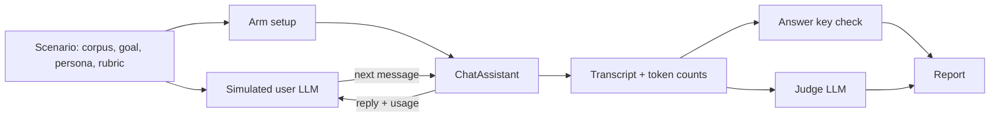

# Evaluation harness

## Goal

Measure whether one of Logicle's retrieval or context strategies is actually better than another,
and by how much, in the only two units that matter: did the user get what they came for, and what
did it cost.

Logicle is accumulating algorithms whose value is an empirical question — knowledge boxes, context
compression, sub-assistants, routing. Each one trades tokens for accuracy somewhere, and none of
them can be evaluated by reading the code. This harness exists so that "is the knowledge box worth
it" has an answer with a number attached.

## Model

An LLM impersonates a user pursuing a goal, and talks to a real Logicle assistant until it decides
the goal is met, gives up, or runs out of turns. The same scenario is replayed against several
**arms** — alternative assistant configurations — and the arms are compared.

For context-policy comparisons, a scenario can instead provide a saved **reference chat**. The
harness preloads that fixed history and sends one fixed final user message. Only the final exchange
is scored. This removes simulated-user trajectory variance and prevents facts already present in
the saved history from satisfying the answer-key gate.



The assistant under test is the real `ChatAssistant`, driven in-process against a throwaway SQLite
database with real files in storage. Ingestion, retrieval, preamble construction and token
accounting are the production code paths — the only substitutions are the human at one end and the
reviewer at the other.

## The wall between the user and the grader

The simulated user receives the goal and the persona. It never receives the rubric or the answer
key.

This is the single property the harness is built around. A simulated user that knows the answer
asks "so the penalty is 2.4%, right?", and from that moment every arm passes — including one that
retrieves nothing at all. The same applies to the exit condition: the simulated user decides only
whether it was _answered_, never whether the answer was _right_, because judging correctness would
require it to know the answer. `apps/backend/lib/eval/__tests__/simulatedUser.test.ts` asserts the
answer key never reaches its prompt.

Grading happens afterwards, in two passes:

- **The answer key** is a deterministic substring check over the assistant's own turns — what the
  user said is excluded, so a leaked answer cannot pass it. It is a hard gate: a run that never
  said the required fact scores zero, no matter how well it reads. `mustNotMention` catches the
  failure mode that matters most here, which is a confident answer taken from the wrong document.
- **The judge** is an LLM that grades how well the goal was served. It runs for every non-error
  transcript; the deterministic gate still controls the final score. The judge receives no arm
  metadata or tool-call/result parts.

The raw run artifact stores both verdicts; the markdown report shows their combined score. When
they disagree, the scenario is usually underspecified.

## Tool visibility

The assistant under test receives the real tool-call and tool-result parts in its next-turn
history, exactly as production does. The simulated user and judge receive a text-only transcript:
user messages and assistant text. Tool names are retained only as run metrics, not injected into
either LLM prompt. This keeps tool activity from revealing an arm directly to the judge.

## Arms

An arm is `setup(context) → { tools, knowledge, systemPromptSuffix?, setupCost? }`. Three ship
with the harness:

| arm                            | what it does                                                                                        |
| ------------------------------ | --------------------------------------------------------------------------------------------------- |
| `all-in-context`               | every document attached as assistant knowledge, sent in the preamble every turn — today's behaviour |
| `knowledge-box`                | documents reachable only through the `knowledge_box` tool, with ingestion questions                 |
| `knowledge-box-no-projections` | the same, with no ingestion questions — isolates chunk retrieval from projections                   |
| `compression-off`              | saved reference history is sent verbatim                                                            |
| `compression-keep-{0,1,2,4}`   | tool-driven retrieval with an explicit number of recent completed turns kept verbatim               |
| `compression-prefetch-keep-0`  | query-aware excerpts, with every eligible historical turn compressed                                |
| `compression-prefetch-keep-1`  | query-aware excerpts, retaining the immediately preceding completed turn verbatim                   |

Anything expressible as "same scenario, different assistant configuration" belongs here. An arm
can return `assistant.contextCompression` to compare compression on versus off; two chunk sizes
are two arms. Adding one does not touch the runner.

## Counting the cost of building an index

An arm that prepares something reports a `setupCost`, and the knowledge box arm reports the tokens
its ingestion questions actually consumed — which is why `computeProjections` returns usage.

Without this the comparison would be dishonest in the knowledge box's favour: it is cheap to query
precisely because it was expensive to build, and quoting only the per-conversation saving hides
the whole other side of the trade. The report therefore derives a **break-even point**: how many
conversations the index has to serve before it has paid for itself. A box that breaks even after
four conversations is obviously worth building; one that breaks even after eight hundred is not,
and the per-conversation figures look identical in both cases.

## Not lying about small samples

Repeated runs of the same scenario against the same arm vary a lot. Reporting one run per arm and
declaring a winner is the main way benchmarks like this mislead.

So `--repeat` defaults to 3, differences are reported as a percentile bootstrap interval on the
difference in means, and any difference whose interval contains zero is printed as _not separable
at this sample size_ rather than as a result. With fewer than two runs per arm the harness refuses
to claim separability at all and says so at the bottom of the report. The bootstrap RNG is seeded,
so re-rendering a report from stored runs gives the same intervals.

`--runs-out` writes a versioned artifact with the raw run records and run metadata (revision,
models, arms, scenarios and sweep configuration). Re-render it without an API key with
`--runs-in runs.json --out report.md`; this also accepts the legacy raw-run-array format.

## Running it

```bash
# Everything, three repetitions
OPENAI_API_KEY=... npx tsx apps/backend/scripts/eval.ts --repeat 3

# One scenario, two arms, watch the conversation happen
OPENAI_API_KEY=... npx tsx apps/backend/scripts/eval.ts \
  --scenario supplier-penalty --arms all-in-context,knowledge-box \
  --repeat 5 --verbose --out report.md --runs-out runs.json
```

The runner creates its own SQLite database and storage directory under the system temp dir and
removes them afterwards. It needs no server and touches no existing database.

Run the fixed-history, single-message context-compression suite with:

```bash
OPENAI_API_KEY=... npx tsx apps/backend/scripts/eval.ts \
  --suite context-compression --repeat 5 \
  --runs-out context-compression-runs.json --out context-compression-report.md
```

Its reference conversations live in
`apps/backend/lib/eval/scenarios/contextCompression.ts`. They retain no production content or
identifiers: only aggregate turn-count cohorts from expensive conversations informed their shape;
all prose, filenames, tool names and answer facts are synthetic.

The default comparison is `compression-off`, tool-only `compression-keep-0`, and query-aware
prefetch with windows 0 and 1. This isolates the two effects observed in the baseline run:
stochastic model tool use and the cost of retaining a recent turn. Wider
`compression-keep-{1,2,4}` arms remain selectable explicitly.

Flags are documented in the header of `apps/backend/scripts/eval.ts`. The ones that matter:
`--repeat`, `--arms`, `--baseline`, `--model`, `--user-model`, `--judge-model`, `--no-judge`,
`--runs-out`, and `--runs-in`.

## Scenarios from real conversations

Hand-written scenarios drift towards what their author already believes the system is good at.
`apps/backend/scripts/eval-mine-scenarios.ts` reads a Logicle database snapshot and proposes
scenario drafts from conversations people actually had — goal, persona, rubric, and candidate
facts copied verbatim from the assistant's answers.

```bash
OPENAI_API_KEY=... npx tsx apps/backend/scripts/eval-mine-scenarios.ts \
  --db /path/to/snapshot.sqlite --limit 20 --out drafts.json
```

Two things about this are deliberate:

- **It produces drafts, not scenarios.** An answer key has to be true of the corpus, and only
  someone who can read the source documents can confirm that. Every draft carries
  `needsReview: true` and its `candidateFacts` are proposals.
- **Point it at a snapshot, not at production.** `logicle-infra-deploy`'s
  `cli/backup_db_to_sqlite_native` produces a suitable SQLite file. The drafts contain verbatim
  user and assistant text: the output file is production data and belongs wherever that tenant's
  data is allowed to live.

## Layout

| path                         | what it is                               |
| ---------------------------- | ---------------------------------------- |
| `lib/eval/types.ts`          | scenario, arm, run result                |
| `lib/eval/harness.ts`        | drives one (scenario, arm) run           |
| `lib/eval/referenceChat.ts`  | saved chat → production message DTOs     |
| `lib/eval/simulatedUser.ts`  | the LLM playing the user                 |
| `lib/eval/judge.ts`          | the LLM grading transcripts              |
| `lib/eval/metrics.ts`        | answer key, totals, scoring — pure       |
| `lib/eval/stats.ts`          | seeded RNG, bootstrap intervals — pure   |
| `lib/eval/cost.ts`           | model pricing — pure                     |
| `lib/eval/report.ts`         | aggregation, break-even, markdown — pure |
| `lib/eval/arms.ts`           | the shipped arms                         |
| `lib/eval/scenarios/`        | scenario definitions                     |
| `lib/eval/scenarioMining.ts` | real conversation → scenario draft       |

Everything marked pure is unit-tested and needs no API key.

## Open

- **The knowledge corpus is synthetic.** `supplierContracts.ts` is built to have the right shape — one needle,
  four near-identical distractors, realistic boilerplate — but it is not a real corpus. Mining real
  scenarios is the intended next step, and the answer keys they produce need a human pass.
- **One provider at a time.** The assistant, the simulated user and the judge all run on the same
  provider. Using a different model family for the judge would reduce the risk of a model
  preferring its own phrasing.
- **Setup cost is paid per repetition.** Ingestion runs once per run rather than once per arm, so
  wall-clock time scales with `--repeat` more than it needs to. It does not distort the reported
  numbers, since setup cost is reported per-arm rather than summed.
- **Context-compression references are anonymized shape fixtures.** They reproduce aggregate
  message-count cohorts and failure modes, not any real conversation's wording. Add reviewed,
  tenant-approved fixtures separately if production semantics need to be represented.

## Replaying expensive production turns

The synthetic context-compression suite proves the policy against known fixtures. To see how a
change behaves on _real_ expensive traffic — a compression preset, a different model, a new build —
use the two-stage replay workflow: **build a bundle**, then **replay it** through the code you want
to test. The stages are fully separated. The bundle is a self-contained SQLite file; once it
exists, replay never touches the source deployment, S3, or any network beyond the LLM provider.

The replay is not an off/on comparison — it runs each turn once, with whatever configuration you
give it. The "before" number to compare against is production's own `MessageAudit` input-token
count, which travels in the bundle.

### Stage 1 — build the bundle

`eval-build-replay-bundle.ts` ranks `MessageAudit` records of type `user` by their **audited input
tokens** (the persisted provider count for the invocation, so it selects genuinely costly prompts,
not merely long-looking messages). For each admitted turn it copies into the bundle: the full
parent lineage, the `MessageAudit` row, the published assistant configuration (`Assistant` /
`AssistantVersion` / `Backend`), the saved production reply, and every attachment — `File` /
`FileBlob` rows rewritten as `production-replay-user`-owned with encryption cleared, and the bytes
themselves **decrypted** into a `ReplayFileBlob(path, size, bytes)` table. No provider
credentials, no storage credentials, no other tenant data.

The builder is infra-agnostic: it reads the source database from `--source-db` (or `$DATABASE_URL`)
and attachment bytes through the normal storage stack (`FILE_STORAGE_LOCATION` plus the
`FILE_STORAGE_ENCRYPTION_*` vars, only needed when a selected turn has attachments).

**Lowest friction — run it on a running instance.** Exec into a Logicle container: `DATABASE_URL`
and `FILE_STORAGE_LOCATION` are already set to that instance's database and object store, so no
flags and no proxy are needed. Copy the bundle back out afterwards (`kubectl cp` / `docker cp`).

```bash
# inside the container (its own env already points at the right DB + storage)
npx tsx apps/backend/scripts/eval-build-replay-bundle.ts \
  --out /tmp/expensive.sqlite --min-input-tokens 12000 --limit 25
```

**From a workstation** — point `--source-db` and `FILE_STORAGE_LOCATION` at the tenant through
whatever proxy / SSH tunnel your ops tooling provides (that wrapper, not this script, owns the
tenant plumbing):

```bash
FILE_STORAGE_LOCATION=s3://logicle-tenant-42-files \
FILE_STORAGE_ENCRYPTION_ENABLE=1 FILE_STORAGE_ENCRYPTION_KEY=... \
npx tsx apps/backend/scripts/eval-build-replay-bundle.ts \
  --source-db postgres://readonly@127.0.0.1:5432/logicle \
  --out expensive.sqlite --min-input-tokens 12000 --limit 25
```

Turns are skipped (with a reason, written to `<out>.skipped.json`) when the lineage has saved tool
activity, the assistant is configured with tools / sub-assistants / knowledge files, or an
attachment's rows or bytes cannot be resolved — so a replay never silently omits a file or loses a
tool capability. To cover tool conversations, extend the builder with a tool-specific fixture
adapter.

### Stage 2 — replay the bundle

```bash
# Replay with each turn's saved configuration (a sanity check — should roughly match production):
OPENAI_API_KEY=... npx tsx apps/backend/scripts/eval-replay-production-chats.ts \
  --bundle expensive.sqlite --out replay-results.json --report replay-report.md

# Replay with a change applied — here, a compression preset — and read the delta vs production:
OPENAI_API_KEY=... npx tsx apps/backend/scripts/eval-replay-production-chats.ts \
  --bundle expensive.sqlite --out compressed-results.json --report compressed-report.md \
  --override '{"contextCompression":{"preset":"conservative"}}' --judge
```

The runner copies the bundle to a scratch directory, points the app at that copy and at
`FILE_STORAGE_LOCATION=replaydb:` (`DbBlobStorage` serves attachment bytes straight from
`ReplayFileBlob`), and for each turn rebuilds the saved assistant with `--override` merged over its
configuration, runs the turn once, and records the response, the real provider token usage, and
the priced cost. `--override` is a JSON object merged over `model` / `systemPrompt` / `temperature`
/ `tokenLimit` / `reasoning_effort` / `contextCompression` (use `{"contextCompression":null}` to
turn it off); its shape follows whatever the running code's schema accepts, so newer options work
without changing this script.

`replay-report.md` shows, per turn, production's audited input tokens next to the replay's input
tokens, output tokens, priced cost, and the input-token delta. With `--judge`, each response is
also classified against the saved production reply — a **reference for the judge, not a factual
answer key**, so review every non-equivalent case.

To test a **new build**, check it out (or deploy it) and run the runner from there — it passes the
config through and calls whatever `ChatAssistant` is in the tree. Build and replay from the same
checkout so the bundle schema matches.

### Deploy-then-evaluate

Low-risk rollout for a change like a compression policy: deploy the new build to one tenant with
the policy **off**, let real traffic accumulate `MessageAudit` rows, build a bundle from that
instance, then replay it twice — once as-is, once with `--override` enabling the policy — and
compare cost and judged quality before turning it on for real.
