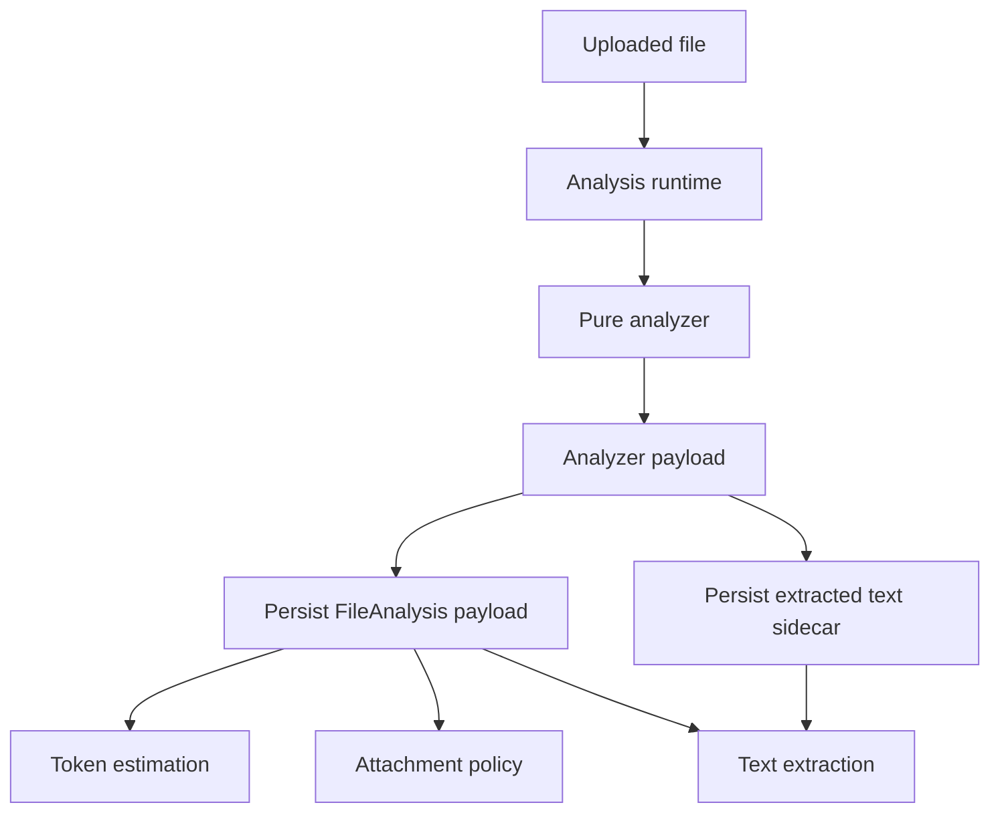
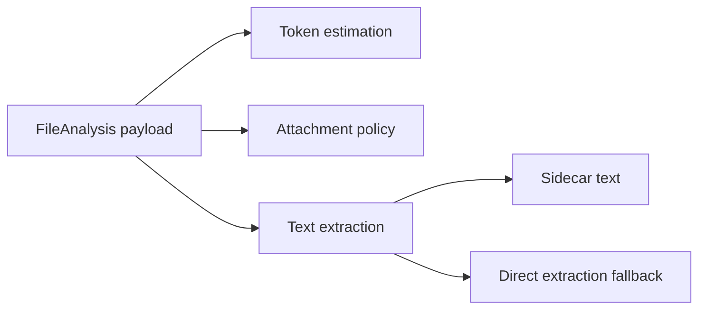
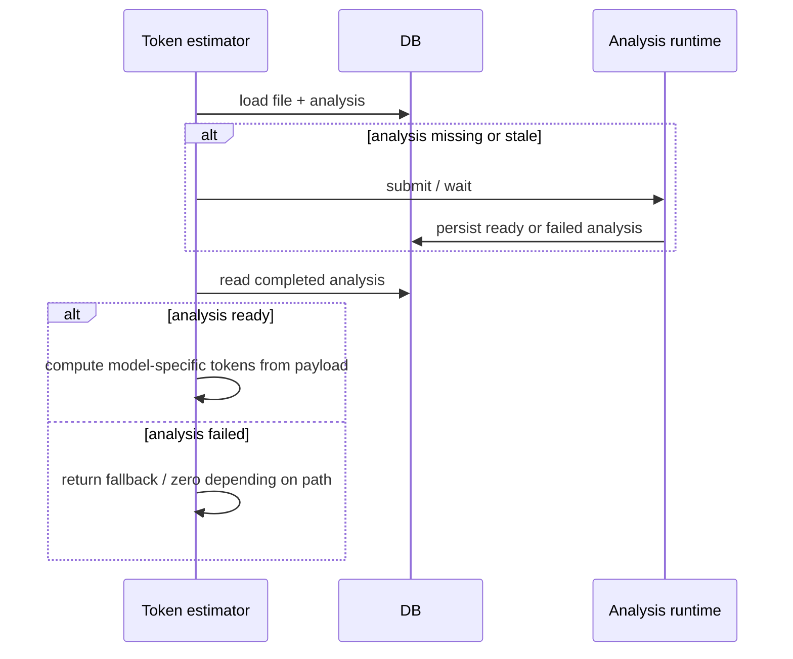

# File Processing Architecture

## Goal

Keep file processing simple:

- analysis is the only heavy file-understanding step
- token estimation consumes persisted analysis
- text extraction prefers persisted analysis
- message conversion may still load file bytes, but token estimation should not

## Main Idea

The architecture is intentionally split into two layers:

- `buffer + mimeType -> analyzer payload`
- `persisted analysis payload -> token estimation / extraction / attachment policy`

This keeps the future worker boundary clean. A worker can own analysis production, while the app process consumes the persisted contract.

## High-Level Flow

## Analysis Responsibilities

Analysis is responsible for understanding the file format and producing a typed payload.

- input: file bytes and mime type
- output: per-format payload such as PDF, image, word, spreadsheet
- optional output: extracted text before persistence

The pure analyzer should stay free of app concerns such as model-specific token pricing, chat conversion, or storage policy.

## Runtime Responsibilities

The runtime is responsible for persistence and completion semantics.

- schedule analysis
- wait until analysis is `ready` or `failed`
- serialize the analyzer payload into `FileAnalysis.payload`
- persist extracted text into a sidecar when present
- store `extractedTextPath` in the payload

Internally, analysis is treated as completed only when it is:

- `ready`
- `failed`

There should be no soft "maybe ready" path inside internal consumers.

## Persisted Contract

`FileAnalysis.payload` is the contract consumed by the rest of the app.

It should answer:

- what file kind is this?
- what structural features matter?
- is extracted text available?
- where is the extracted text sidecar?

Examples:

- PDF: `pageCount`, `visionPageCount`, `contentMode`, `extractedTextPath`
- image: `width`, `height`, `format`
- office docs: text and structural metadata as needed

## Consumer Layers

### Token Estimation

Token estimation is model-dependent, but payload-driven.

- it may enqueue or wait for analysis
- it reads the persisted payload from the database
- it computes model-specific cost from payload features
- it uses a model-dependent cache
- it does not download file bytes

For example:

- PDFs use persisted analysis features plus extracted-text tokens when available
- images use persisted dimensions

### Attachment Policy

Attachment policy is also payload-driven.

- native attachment support depends on model capabilities
- page limits and similar restrictions depend on analysis payload
- PDF/image special handling lives in policy helpers, not in the analyzer

### Text Extraction

Text extraction is layered on top of analysis.

- first try analysis-backed extracted text
- if unavailable or unreadable, fall back to direct extraction

This makes extracted text reusable without forcing every consumer to parse files again.

## Practical Flow For Token Estimation

## Design Rules

- token estimation should not parse files
- conversion to `ai.ModelMessage` may still load files when truly needed
- attachment policy should be shared between conversion and token estimation
- analysis payload helpers should stay data-driven and small
- avoid generic abstraction when a typed payload and a few pure functions are enough

## Consequences

- PDFs are not uniquely special in architecture terms; they are just the most developed analyzed kind
- images fit the same pattern
- office documents can follow the same path incrementally
- moving analysis to a worker later should be straightforward because the contract already lives in persisted payloads
