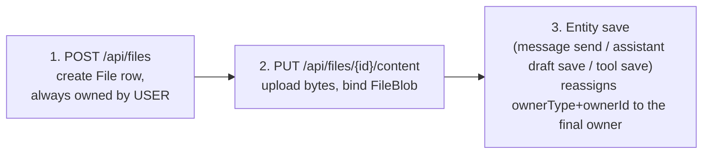

# File Ownership and Upload Security

## Goal

Every `File` row belongs to an owner: `USER`, `CHAT`, `ASSISTANT`, or `TOOL`. Reading a
file and writing (uploading) its content are different permissions, and must be checked
differently — being able to view/use a chat, tool, or assistant must never imply being
able to overwrite the bytes of a file attached to it. This document exists because that
distinction was lost once already (see "History" below) and cost real debugging time to
recover.

## The three-step upload flow

Every upload flow in the app — chat attachments, assistant knowledge files, tool
knowledge files — follows the same three steps:

1. **Create** (`POST /api/files`) — the frontend creates the `File` metadata row.
   It is always created `USER`-owned by the uploader, never with the final owner
   (`CHAT`/`ASSISTANT`/`TOOL`) set directly, even when that target entity already
   exists.
2. **Upload** (`PUT /api/files/{id}/content`) — streams the content to storage,
   dedupes by content hash, and binds `File.fileBlobId` (`finalizeUploadedFile` in
   `apps/backend/lib/files/upload-dedup.ts`). This only ever happens while the file
   is still `USER`-owned.
3. **Transfer** — ownership moves from `USER` to the final owner as a side effect of
   saving the entity the file is attached to, not as a separate explicit step:
   - `reassignUserOwnedFilesToConversation` (`apps/backend/models/file.ts`) — runs on
     every user message with attachments (`startServerChatRun.ts`, and the public
     `v1/responses` API).
   - `transferFilesToAssistantOwner` (`apps/backend/models/assistant.ts`) — runs
     whenever an assistant version is created or its draft is saved with a file list
     (`updateAssistantVersion`), i.e. whenever the assistant form is saved, not
     immediately when a file finishes uploading in the Knowledge tab.
   - `transferFilesToToolOwner` (`apps/backend/models/tool.ts`) — runs on tool
     creation and update.

   A consequence worth knowing: a knowledge file uploaded in an assistant's Knowledge
   tab sits `USER`-owned until the assistant form is actually saved. If the user
   navigates away without saving, the file stays `USER`-owned indefinitely (harmless,
   but orphaned).

## Authorization model

Because uploads only ever happen while a file is `USER`-owned, and ownership never
moves in the other direction, **write access only ever needs to check `USER`
ownership** — `canWriteFile` (`apps/backend/lib/files/authorization.ts`) is a single
line: `ownerType === 'USER' && ownerId === caller`. Read access (`canAccessFile`,
`canAccess`) is broader and genuinely different per owner type, since viewing a shared
chat, a public tool, or a shared assistant is a legitimate read permission that must
not carry write rights with it:

| `ownerType` | Read (`canAccess`) | Write (`canWriteFile`) |
|---|---|---|
| `USER` | caller is the owner | caller is the owner |
| `CHAT` | conversation owner, or anyone holding a share on it | never (file is no longer `USER`-owned) |
| `ASSISTANT` | `canUserAccessAssistant` — owner, public share, or workspace share | never |
| `TOOL` | public → anyone; workspace → workspace member; private → admin | never |
| unowned (legacy, no `ownerType`/`ownerId`) | readable (permissive fallback) | never (no owner to check) |

The legacy-unowned-readable fallback exists for files predating the ownership
tracking columns; there is no migration script that backfills an owner for them, so
removing that fallback (making them unreadable, including to admins) would be a
regression, not a hardening.

See `apps/backend/lib/files/__tests__/authorization.test.ts` for executable coverage
of every row of this matrix, including the exact regression below.

## History

PR #1022 ("Harden exposed security boundaries") correctly identified a real hole: the
upload endpoint used the same read-level check as downloads (`canAccessFile`), so
anyone with mere *read* access to a shared conversation, a public tool, or a shared
assistant could overwrite that entity's file content — never intended, since sharing a
conversation is explicitly meant to be read-only. Its fix (`canWriteFile` requiring
`ownerType === 'USER'`) was the right shape but didn't account for the fact that three
frontend flows (chat attachments, assistant knowledge, tool knowledge) created files
directly with their final, non-`USER` owner when the target entity already existed —
breaking uploads for all of them. The same commit also removed the legacy-unowned
read fallback without a migration path, making pre-existing files unreadable by
everyone, including admins.

The fix applied afterward (this document, `canWriteFile`, and the three upload
components) restores the original one-line `canWriteFile` check and the legacy-read
fallback, and instead makes the three affected frontend flows always create `USER`-
owned files — relying on the transfer mechanisms above, which already ran
unconditionally on every save, not just creation. This closes the original hole
(read access no longer implies write access) without reintroducing the upload
regression.
