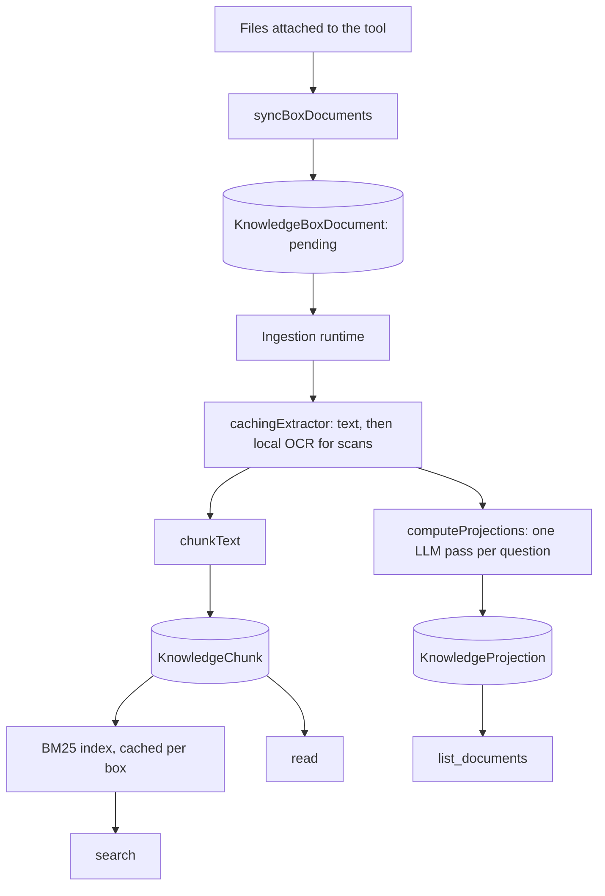

# Knowledge boxes

## Goal

Let an assistant work with a set of documents without paying to put them in the context window.

The existing `knowledge` tool hands the model a whole file (`GetFile(id)`), and assistant knowledge
files go into the preamble outright. Both are fine for a couple of small documents and ruinous for
anything larger. A knowledge box replaces "read the file" with "look it up".

## Main idea

Two indexes are built once, at ingestion, and read many times afterwards:

- **Chunks** — the document text, split on paragraph boundaries, ranked with BM25 at query time.
  This is ordinary retrieval.
- **Projections** — the answers to a set of questions the _administrator_ writes, asked once per
  document by an LLM at ingestion. The answers are free-form text, stored per (document, question).

Projections are the part that makes retrieval cheap. Before searching, the model calls
`list_documents` and gets, for every document, a few lines answering "what is this about", "who are
the parties", "what period does it cover" — whatever the admin asked. That is enough to decide
_which_ document to search, so the search that follows is narrow and the model never loads a file it
did not need.

## Shape

A knowledge box is a tool of type `knowledge_box`. Its configuration holds the attached files
(managed by the shared `ToolKnowledgeSection`, like any other file-backed tool) and the list of
questions. The tool id is the box id, so a box is scoped to exactly one tool and cannot surface a
file attached to another.

## Tool functions

| function                         | cost                 | purpose                                                     |
| -------------------------------- | -------------------- | ----------------------------------------------------------- |
| `list_documents(query?, limit?)` | bounded, see below   | the map: file name, id, chunk range, and projection answers |
| `search(query, fileIds?)`        | one page of passages | BM25 over the box's chunks, returning file id + chunk index |
| `read(fileId, from, to)`         | on demand            | a contiguous run of chunks, capped at 12 per call           |

`read` only accepts a file that is in the box's own configuration, and every query is scoped by box
id, so there is no id a caller can pass to reach outside it.

### Why the listing is ranked and budgeted

Projections cost about 250 tokens per document. Returning all of them for all documents makes the
listing grow with the size of the box — at 50 documents it is ~12k tokens, at 200 it is ~50k, and
the "cheap map" ends up costing more than the documents it was meant to keep out of the prompt.
Benchmarking caught this inverting at five documents: a box _with_ ingestion questions lost to the
same box without them, because it paid for the whole map before deciding it still had to search.

So `list_documents` takes an optional query, ranks documents against a second BM25 index built over
their projections (falling back to the chunk index for a box configured without questions), and
returns at most `limit` of them (default 10, hard maximum 50). The projection text is then rendered
against a character budget in rank order: the highest-ranked documents arrive with their answers in
full, and the rest arrive as bare entries the model can still search or read by id. The listing is
bounded by construction rather than by how the box happens to be configured.

## Ingestion

`KnowledgeBoxDocument` is the state machine, one row per (box, file): `pending → running →
ready | failed`. It carries a `configHash` (over the questions) and an `ingestVersion`, and
`syncBoxDocuments` re-queues any row whose hash or version no longer matches — the same
invalidation contract `FileAnalysis` uses for `analyzerVersion`. Saving the tool is therefore the
only action an administrator needs: attaching a file queues it, editing a question re-queues
everything.

The runtime (`lib/knowledge/runtime.ts`) is an in-process loop, not a worker thread. Ingestion is
I/O bound — a storage read and one LLM round trip per question — and the only CPU-heavy step, format
parsing, already runs in the file-analyzer worker via `cachingExtractor`. Claiming a document is a
conditional `UPDATE ... WHERE status = 'pending'`, so several replicas can run the loop without
ingesting anything twice, and documents left `running` by a process that died are re-queued after 15
minutes.

Projection prompts keep the document text in the user message and the instructions in the `system`
option, never as a system-role message: the document is untrusted input.

## Retrieval

BM25 runs in memory (`lib/knowledge/bm25.ts`), over the chunk set of a single box, cached per box
and invalidated by a signature derived from the box's document rows. This is deliberate: SQLite
FTS5 and PostgreSQL `tsvector` would need two implementations and two migration paths for a corpus
that is bounded by construction, and keeping ranking in TypeScript makes it pure and testable.

There is no vector index yet. `Bm25Index.search` returns `{ ref, score }`, which is the shape a
vector index would also return, so adding one later is a fusion step rather than a rewrite. That
change would need an embedding model configured per box — see the "Embeddings" decision left open
below.

## Configuration

| variable                              | default | meaning                                                     |
| ------------------------------------- | ------- | ----------------------------------------------------------- |
| `KNOWLEDGE_BOX_INGESTION_ENABLED`     | on      | set to `0` to keep the ingestion loop from starting         |
| `KNOWLEDGE_BOX_POLL_INTERVAL_SECONDS` | 30      | idle poll interval; saving a box wakes the loop immediately |
| `KNOWLEDGE_BOX_INGEST_BATCH_SIZE`     | 4       | documents drained per pass before sleeping                  |

The ingestion model is not configurable: it reuses the summarizer's "cheap model for internal work"
choice, falling back to the best-scoring configured backend. With no backend configured, ingestion
still produces chunks and simply skips projections.

### Scanned documents

Text extraction is always attempted first. When file analysis identifies a scanned PDF (or the
file is an image) and the normal extractor returns no text, the runtime uses the local OCR
fallback: Poppler renders PDF pages at 300 DPI and Tesseract produces searchable text. OCR
is used to build chunks and retrieval indexes; the original file remains the authoritative source
for exact values, formulas, and other details that OCR may misread.

The PDF is not sent to the model merely because it exists. Retrieval first uses the OCR text to
identify relevant chunks and the corresponding file; only when the model requests that file is the
original PDF returned, and then only when the provider supports native PDFs and the page limit
allows it. Otherwise the existing text fallback is used.

The production image includes Tesseract with Italian and English language data. `TESSERACT_BIN`,
`PDFTOPPM_BIN`, `PDFINFO_BIN`, and `TESSERACT_LANG` can override the binaries or language set for a
deployment. OCR is bounded to 100-page PDFs and falls back to the existing unavailable-text
behavior if a binary is missing or the conversion fails.

## Open

- **Embeddings.** Semantic retrieval is deliberately absent from the first version. `ai@6` ships
  `embedMany` and `cosineSimilarity`, so no new dependency is needed; what is missing is a decision
  on where vectors come from (a configured backend plus a model id) and on storage (a BLOB column
  with brute-force cosine keeps SQLite and PostgreSQL on one path; pgvector would not).
- **Per-box chunking options.** `defaultChunkingOptions` is global. Documents with very different
  structure (a contract versus a spreadsheet export) may deserve different targets.
